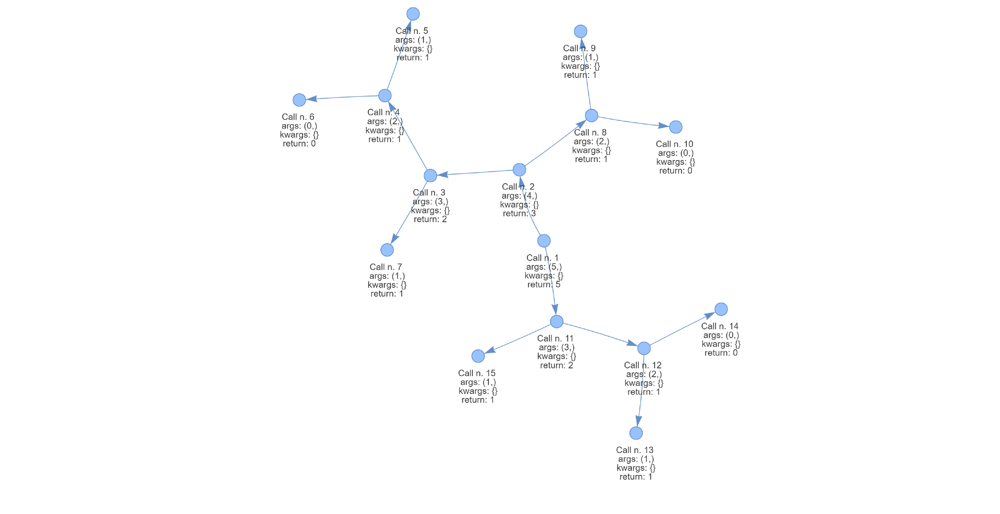

# TraceRecursio

**TraceRecursio** is a Python library that provides a decorator to trace the execution of recursive functions. The library generates a visual representation of the recursion process through a directed graph, allowing you to observe how the function operates step-by-step, tracking the parameters, return values, and the order of function calls.

## Features
- **Trace decorator**: Easily apply the `@Trace` decorator to any recursive function to start tracing its execution.
- **Graphical Representation**: The library generates an interactive graph where each node represents a function call and edges show the call relationships.
- **Detailed call information**: For each recursive call, the parameters, return values, and call order are tracked and displayed.
- **HTML output**: The graph is exported as an interactive HTML file for easy visualization.

## Installation

You can install **TraceRecursio** via PyPI:

```bash
pip install tracerecursio
```

## Quickstart

Here is a minimal example to demonstrate the library’s functionality:

```python
from TraceRecursio import Trace

# Applying the Trace decorator to a recursive function
@Trace
def factorial(n):
    if n == 1:
        return 1
    return n * factorial(n - 1)

# Call the function
factorial(5)

# Generate and visualize the graph
Trace.get_graph('factorial')
```

Running this code will generate a `factorial.html` file that contains the interactive graph of the recursive calls.

## Use Cases

### Example 1: Fibonacci Sequence


In this example, we apply `@Trace` to a recursive function that calculates the nth number in the Fibonacci sequence. The decorator will track each step of the recursion:

```python
from TraceRecursio import Trace

@Trace
def fibonacci(n):
    if n <= 1:
        return n
    return fibonacci(n - 1) + fibonacci(n - 2)

fibonacci(5)

# Generate the graph visualization
Trace.get_graph('fibonacci')
```



## How It Works

The `@Trace` decorator monitors the execution of recursive functions. The key method is `get_graph`, which generates an interactive HTML file displaying:
- **Nodes**: Represent each function call.
- **Edges**: Show the relationship between parent and child function calls.
- **Detailed information**: Each node contains the arguments, return value, and call order for the corresponding function call.

## Documentation

For detailed documentation and more examples, check out the [official documentation](#).

## Contributing

We welcome contributions! Please feel free to submit a pull request or open an issue.

## License

This project is licensed under the MIT License.
